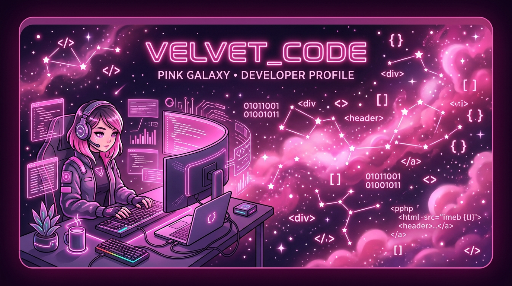

  

  

  

<!-- 🎀 GITHUB TROPHIES PINK THEME 🎀 -->

  

  <a href="https://portfolio-zahrah.vercel.app/"><b>✨ Click Here to Visit My Cute Portfolio Website ✨</b></a>

### 🌸 About Me

👋 **Hello, lovely visitors! I'm Zahrah Aliyah**, a passionate **Fresh Graduate Fullstack Developer** based in Surabaya, Indonesia 🇮🇩 ✨.

💖 I love coding and designing websites. For me, web development is not just about logic, but also about making things look super cute, clean, and satisfying for users!

🎓 Graduated in **Information Systems** with a perfect GPA of 3.94, and certified as a **Junior Web Programmer**.

⭐ Feel free to explore my repositories or contact me for collabs and project inquiries!

  

### 🎀 Tech Stack & Tools

#### 🌸 Frontend & UI/UX Design

  
  
  
  
  
  

#### ⚙️ Backend & Database Systems

  
  
  
  
  

#### 🛠️ Development Tools

  
  
  

### 📁 Featured Projects

*   **🍂 Wismilak Cigars Website** — An elegant, responsive product showcase website designed to present Wismilak's premium cigar line, catalog, and brand heritage. Built with PHP (Laravel) and Tailwind CSS.
*   **⚖️ PMII Hukum UPN Website** — Official website for PMII Hukum UPN organization, featuring article publishing, activity updates, and member management system. Built with PHP, Bootstrap, and MySQL.
*   **🌸 Creativo** — Creative Education & Marketplace web application where users can take courses and local artists can sell their artwork. Built with Laravel, Tailwind, and MySQL.
*   **📚 Buku Tamu Jatim** — Web guestbook application developed for Dinas Pendidikan Provinsi Jawa Timur, featuring a dashboard for guest log reporting. Built with Laravel.
*   **🧸 Kidzello** — Interactive Learning App UI/UX design with parent monitoring and creative spaces for kids. Designed in Figma.
*   **🏡 SiDesa** — Village Inventory & Asset Information System UI/UX design for administrative transparency. Designed in Figma.

### 💖 My GitHub Stats

  
  &nbsp;&nbsp;
  

  

### 📫 Connect with Me

  
  
  
  

  

